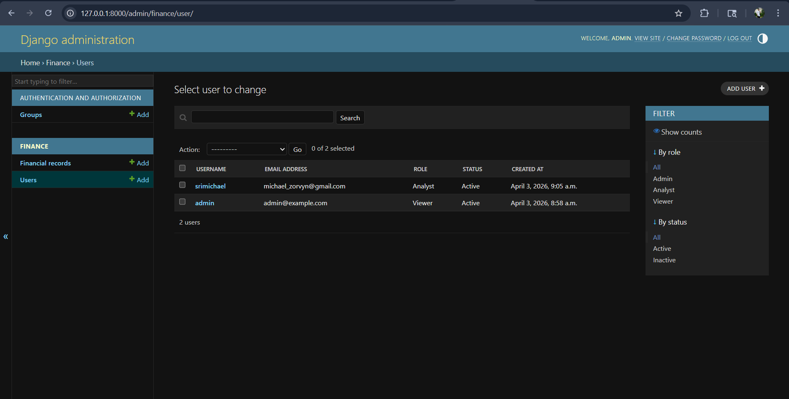
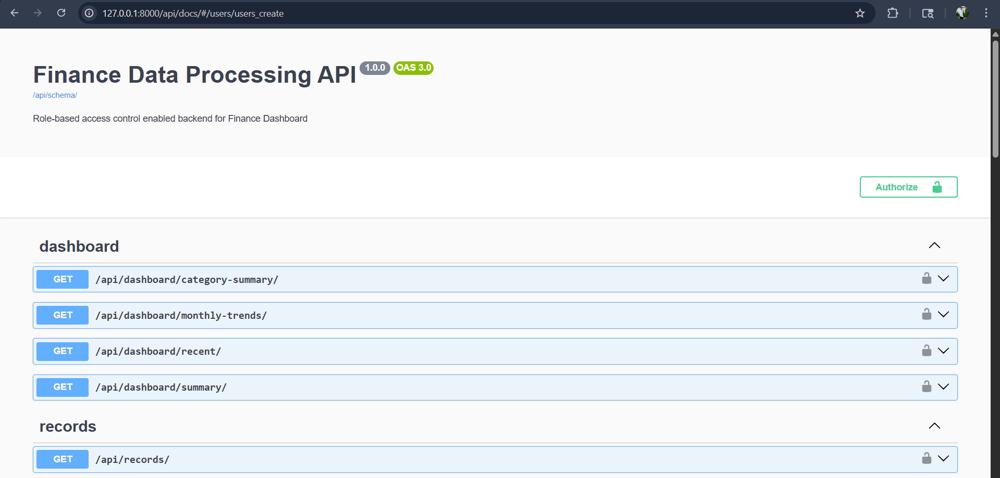

# Finance Data Processing Backend 🚀

A comprehensive, role-based backend system built with **Django** and **Django REST Framework (DRF)**. This system allows you to manage financial records securely, providing different levels of access depending on user roles (Admin, Analyst, and Viewer).

---

## 🎯 Features

- **Custom User Roles:** Built-in Django User model extended with `role` (Admin, Analyst, Viewer) and `status` fields.
- **Secure Authentication:** Standard Django Session and Basic Authentication ensuring secure endpoints.
- **Role-Based Access Control (RBAC):**
  - **Admin:** Unlimited and full CRUD access to all users and financial records.
  - **Analyst:** Read-only access to the financial records and the statistics dashboard.
  - **Viewer:** Restricted strictly to the Dashboard statistics endpoints (Read-only).
- **Automated Validation:** Business logic validation (e.g., verifying amount is strictly > 0, ensuring fields are properly populated).
- **Advanced Filtering:** Filter endpoints easily by `type`, `date`, or `category`.
- **Swagger Documentation:** Auto-generated interactive API documentation via `drf-spectacular`.

---

## 🛠️ Technology Stack

- **Framework:** Python / Django / Django REST Framework
- **Database:** SQLite (default Django database)
- **Filters:** django-filter
- **Documentation:** drf-spectacular (OpenAPI 3.0)

---

## 📂 Project Structure

```text
finance-backend/
│
├── finance_backend/        # Main Django project settings & configuration
│   ├── settings.py         # Includes custom auth model, installed apps, and DRF config
│   ├── urls.py             # Main router mapping (redirects root '/' to Swagger Docs)
│
├── finance/                # Core Application module
│   ├── models.py           # Database definitions (Custom User & FinancialRecord)
│   ├── serializers.py      # Data validation rules & explicit DRF mappings
│   ├── views.py            # ViewSets handling the query logic and dashboard aggregation
│   ├── permissions.py      # Custom DRF Permission classes mapping the RBAC roles
│   ├── admin.py            # Clean Django Admin visual configurations
│   ├── urls.py             # Feature routing setup for Users, Records, and Dashboard
│
└── manage.py               # Django execution script
```

---

## 💻 Local Setup & Installation

### 1. Requirements
Ensure you have **Python 3.10+** installed.

### 2. Install Dependencies
Run the following pip command to install the required libraries:
```bash
pip install django djangorestframework django-filter drf-spectacular
```

### 3. Database Migration
Populate the database with the generated models:
```bash
python manage.py makemigrations
python manage.py migrate
```

### 4. Create an Administrator
To manage the system manually through the Django Admin interface or Swagger, create a superuser:
```bash
python manage.py createsuperuser
```

### 5. Start the Server
Launch the application locally:
```bash
python manage.py runserver
```

---

## 📖 How to Use & Test the APIs

Because we are using Django's Session Authentication out of the box, testing in your browser is incredibly easy.

1. Start the server and head to `http://localhost:8000/admin/`.
2. **Log in** using the Superuser account you created.
3. Open a new tab and head to `http://localhost:8000/api/docs/` (or strictly `http://localhost:8000/`).
4. **Interactive Swagger:** Because you logged in through the admin panel, your session is verified! You can interactively test the endpoints natively inside Swagger by clicking **"Try it out"**.

*(To test other roles, log out from the admin site, create a user like `test-analyst` using your superuser account, login as the analyst instead, and verify the restricted permissions in the Swagger UI).*

---
## Screenshots





---

## 🔗 Main Endpoints

### Users (`/api/users/`)
- `GET /api/users/`: List all users *(Admin Only)*
- `POST /api/users/`: Create a user (Auto-hashes passwords natively)

### Financial Records (`/api/records/`)
- `GET /api/records/`: Get all records (Accepts filters: `?type=income`, `?category=food`, `?date=YYYY-MM-DD`)
- `POST /api/records/`: Create a new record (Auto-binds to logged-in user)
- `PATCH /api/records/{id}/`: Update an individual record

### Dashboard Summaries (`/api/dashboard/`)
- `GET /api/dashboard/summary/`: Fetch totals *(Total income, Total expenses, Net balance)*
- `GET /api/dashboard/category-summary/`: Data aggregated by category.
- `GET /api/dashboard/monthly-trends/`: Financial records truncated to monthly insights.
- `GET /api/dashboard/recent/`: The last 10 transactions added to the system.

---

## 🤔 Technical Decisions and Trade-offs

1. **Framework Choice (Django + DRF)**
   - **Decision:** Selected Django and DRF instead of a lighter framework like FastAPI or Flask.
   - **Trade-off:** Django has a heavier footprint and a slightly steeper learning curve for simple APIs. However, the trade-off is massively accelerated development speed—Django provides a built-in ORM, admin panel, and robust security practices out-of-the-box, which perfectly fits a highly relational, permission-heavy financial application.

2. **Authentication Standard (Session vs. JWT)**
   - **Decision:** Used native Django Session authentication instead of Stateless JWT tokens.
   - **Trade-off:** Session auth uses stateful cookies. This isn't ideal if a native mobile app consumes the API or if the backend scales across multiple disparate servers. However, it avoids token expiration overhead, entirely eliminates token refresh setups, and allows seamless integration with the built-in Swagger UI and Django Admin.

3. **Role-Based Access Control (Custom Field vs. Django Groups)**
   - **Decision:** Implemented RBAC using a specific `role` string field on a Custom `User` model, enforced via custom DRF Permission classes (`IsAdminRole`, `IsAnalyst`, etc.).
   - **Trade-off:** Alternatively, one could use Django's native `Group` and `Permissions` framework. While groups allow for granular, database-driven permission scaling, using a static `role` field prevents excessive database joins on every request and keeps the business logic incredibly simple and readable for the 3 rigid roles specified.

4. **Dashboard Aggregation Logic (Database vs. Application Layer)**
   - **Decision:** All dashboard calculations (totals, trends) are handled via Django ORM aggregate/annotate functions (`Sum`, `TruncMonth`).
   - **Trade-off:** Aggregating data at the database level is highly performant and uses very minimal memory compared to pulling records into Python strings/loops. The trade-off is that direct database calculation can block transactions if the dataset grows to millions of rows. At hyper-scale, these queries would need to be moved to a cache (like Redis) or an asynchronous background task.

5. **Database (SQLite)**
   - **Decision:** Kept SQLite as the backend database.
   - **Trade-off:** SQLite stores data in a simple file, making local setup frictionless and perfect for technical assignments/prototyping. The main trade-off is that it does not handle concurrent write operations well. For a true production deployment, switching to PostgreSQL by updating `settings.py` is recommended.
